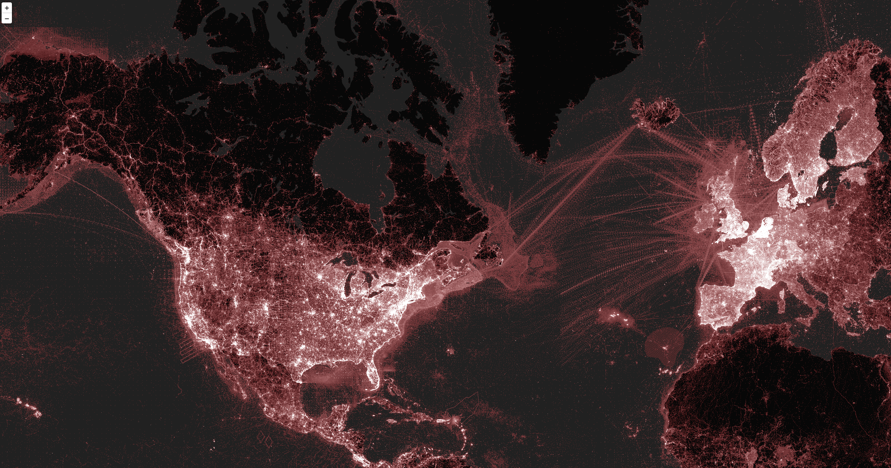
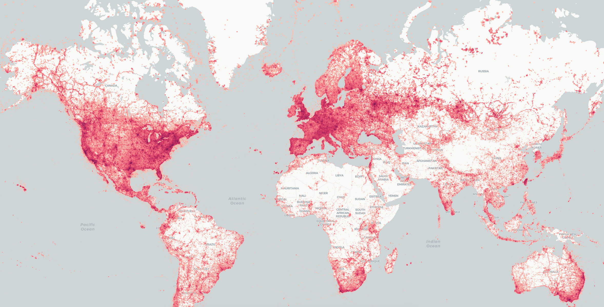

# Clickhouse maps

A proof of concept using Clickhouse to serve GBIF maps. 
There are two procedures demonstrating how to aggregate to pixel level and how to use H3 indexes. 

The pixel work replicates [the work](https://clickhouse.com/blog/interactive-visualization-analytics-adsb-flight-data-with-clickhouse) of [Alexey Milovidoc](https://github.com/alexey-milovidov) 
and the user interface for the hexagon builds on ideas from [INSPIDE](https://github.com/INSPIDE/h3j-h3t).

## Example

The following illustrates the outputs (visible as [pixels](http://scrap-vh.gbif-dev.org:8123/map.html) 
or [hexagons](http://scrap-vh.gbif-dev.org:8123/inaturalist.html) while on the GBIF network).

#### Georeferenced data in GBIF.org at pixel level


#### Georeferenced data in iNaturalist (in GBIF.org) aggregated to H3 hexagons


## Procedure

The following illustrates the general procedures, but may have errors.

### Pixel maps

The browser is issuing SQL directly to the clickhouse server. The SQL aggregates to pixel level, applies styling and returns a byte array for the tile.
JS is used to copy (not parse) the byte array straight onto the canvas, and this is adapted for use in a Leaflet slippy map. In production an intermediate service might sit between the browser and clickhouse.
The SQL can be adjusted to replicate any of the dimensions supported by the GBIF v2 map API.

#### Prepare data

This is using the production GBIF Hive warehouse. It would be easy to port this to use Iceberg.

```
SET mapreduce.job.reduces = 100;
CREATE TABLE tim.map_source STORED AS parquet AS
SELECT 
 datasetKey, publishingOrgKey, publishingCountry, networkKey,
 countryCode, basisOfRecord, decimalLatitude, decimalLongitude,
 kingdomKey, phylumKey, classKey, orderKey, familyKey,
 genusKey, speciesKey, taxonKey, year, count(*) AS occCount
FROM prod_h.occurrence 
 WHERE occurrenceStatus = 'PRESENT' AND hasGeospatialIssues = false
GROUP BY
 datasetKey, publishingOrgKey, publishingCountry, networkKey,
 countryCode, basisOfRecord, decimalLatitude, decimalLongitude,
 kingdomKey, phylumKey, classKey, orderKey, familyKey,
 genusKey, speciesKey, taxonKey, year;
```

#### Setup clickhouse

Get the data onto the machine:

```
 rclone sync c5:/user/hive/warehouse/tim.db/map_source .
 sudo mkdir /var/lib/clickhouse/user_files/gbif
 sudo mv * /var/lib/clickhouse/user_files/gbif
```

Bring raw data into clickhouse (this could be adapted to just use Iceberg directly):

```
DROP TABLE if exists occurrence;
CREATE TABLE occurrence engine = MergeTree PRIMARY KEY tuple() AS 
SELECT * FROM file('gbif/*', Parquet)
WHERE decimallatitude IS NOT NULL;
```

Index for mercator projection (adapting this for ESPG:4326 would be feasible).

```
DROP TABLE IF EXISTS gbif_mercator;
SET allow_suspicious_low_cardinality_types=1;
CREATE TABLE gbif_mercator
(
    mercator_x UInt32 MATERIALIZED 0xFFFFFFFF * ((decimallongitude + 180) / 360),
    mercator_y UInt32 MATERIALIZED 0xFFFFFFFF * (1/2 - log(tan((decimallatitude + 90) / 360 * pi())) / 2 / pi()),
    INDEX idx_x (mercator_x) TYPE minmax,
    INDEX idx_y (mercator_y) TYPE minmax,
    decimallatitude Float64,
    decimallongitude Float64,
    datasetkey LowCardinality(UUID),
    publishingorgkey LowCardinality(UUID),
    publishingcountry FixedString(2),
    networkkey Array(LowCardinality(UUID)),
    countrycode FixedString(2),
    basisofrecord LowCardinality(String),
    kingdomkey UInt8,
    phylumkey UInt32,
    classkey UInt32,
    orderkey UInt32,
    familykey UInt32,
    genuskey UInt32,
    specieskey UInt32,
    taxonkey UInt32,
    year LowCardinality(UInt16),
    occcount UInt64
) ENGINE = MergeTree ORDER BY (mortonEncode(mercator_x, mercator_y));

INSERT INTO gbif_mercator 
SELECT decimallatitude, decimallongitude, datasetkey, publishingorgkey,
  publishingcountry, networkkey, countrycode, basisofrecord, kingdomkey, 
  phylumkey, classkey, orderkey, familykey, genuskey, specieskey, taxonkey, 
  year, occcount
FROM occurrence 
WHERE decimallatitude between -85 and 85;
```

Create a user account for the application (adapt for real use!):

```
CREATE USER tim IDENTIFIED WITH no_password
SETTINGS
    add_http_cors_header = 1,
    max_result_rows = 1048576,
    enable_http_compression = 1,
    http_zlib_compression_level = 6,
    replace_running_query = 1,
    skip_unavailable_shards = 1,
    use_query_cache = 1,
    query_cache_ttl = 8640000,
    query_cache_share_between_users = 1,
    analyze_index_with_space_filling_curves = 0,
    max_execution_time = 180,
    priority CHANGEABLE_IN_READONLY,
    readonly = 1;
GRANT SELECT ON default.gbif_mercator TO tim;
```

Add a config file in `/etc/clickhouse-server/config.d/map.xml` to enable the 
HTTP service (necessary) and set up a static web (optional).

```
<clickhouse>
  <listen_host>::</listen_host> 	
  <http_handlers>
    <rule>
      <methods>GET</methods>
      <url>/map.html</url>
      <handler>
        <type>static</type>
        <content_type>text/html; charset=UTF-8</content_type>
        <response_content>file:///map.html</response_content>
      </handler>
    </rule>
    <!-- Enable defaults at the end (important) -->
    <defaults/>
  </http_handlers>  
</clickhouse>
```

Optional: copy the index.html file into `/var/lib/clickhouse/user_files/` to allow it 
to be served from http://CLICKHOUSE/map.html. 

### Hexagon maps

The browser is issuing SQL directly to the clickhouse server. The SQL aggregates to an H3 level and returns JSON with the H3 cell and the count.
A custom source is used for the LibreMap GL library to provide a slippy map (it is a quick hack, and would need some work).

#### Setup clickhouse

This assumes the pixel map procedure is complete. If not, then some parts need to be run.

```
DROP TABLE IF EXISTS inat_h3;
SET allow_suspicious_low_cardinality_types=1;
CREATE TABLE inat_h3
(
    mercator_x UInt32 MATERIALIZED 0xFFFFFFFF * ((decimallongitude + 180) / 360),
    mercator_y UInt32 MATERIALIZED 0xFFFFFFFF * (1/2 - log(tan((decimallatitude + 90) / 360 * pi())) / 2 / pi()),
    INDEX idx_x (mercator_x) TYPE minmax,
    INDEX idx_y (mercator_y) TYPE minmax,
    decimallatitude Float64,
    decimallongitude Float64,
    h3_5 UInt64 MATERIALIZED geoToH3(decimallongitude,decimallatitude,5),
    h3_6 UInt64 MATERIALIZED geoToH3(decimallongitude,decimallatitude,6),
    h3_7 UInt64 MATERIALIZED geoToH3(decimallongitude,decimallatitude,7),
    h3_8 UInt64 MATERIALIZED geoToH3(decimallongitude,decimallatitude,8),
    h3_9 UInt64 MATERIALIZED geoToH3(decimallongitude,decimallatitude,9),
    h3_10 UInt64 MATERIALIZED geoToH3(decimallongitude,decimallatitude,10),
    h3_11 UInt64 MATERIALIZED geoToH3(decimallongitude,decimallatitude,11),
    h3_12 UInt64 MATERIALIZED geoToH3(decimallongitude,decimallatitude,12),
    h3_13 UInt64 MATERIALIZED geoToH3(decimallongitude,decimallatitude,13),
    h3_14 UInt64 MATERIALIZED geoToH3(decimallongitude,decimallatitude,14),
    h3_15 UInt64 MATERIALIZED geoToH3(decimallongitude,decimallatitude,15),
    familykey UInt32,
    genuskey UInt32,
    specieskey UInt32,
    taxonkey UInt32,
    year LowCardinality(UInt16),
    occcount UInt64
) ENGINE = MergeTree ORDER BY (mortonEncode(mercator_x, mercator_y));

INSERT INTO inat_h3 
SELECT decimallatitude, decimallongitude, familykey, genuskey, 
  specieskey, taxonkey, year, occcount
FROM occurrence 
WHERE decimallatitude between -85 and 85 AND decimallongitude is not null 
  AND datasetkey='50c9509d-22c7-4a22-a47d-8c48425ef4a7';

GRANT SELECT ON default.inat_h3 TO tim;
```

For the UI, you need to set the clickhouse server in the `example/script.js` and build using the following:

```
npm install
npm run build && npx serve
```

Open the browser at http://localhost:3000/examples/inaturalist 


